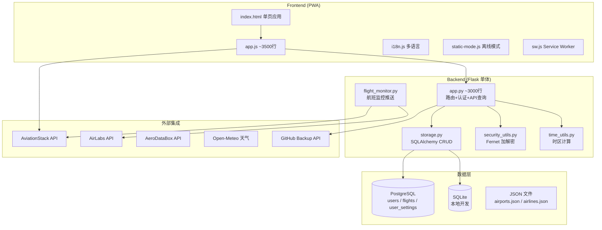

# SkyTrace 当前架构深度分析

> 基于 `skytrace-handover-2026-05-17.zip` 完整源码分析
> 日期: 2026-05-17

---

## 1. 项目概览

SkyTrace 是一个**多用户个人航旅管理系统**，采用 Flask 单体后端 + Vanilla JS 前端 + PostgreSQL 数据库的经典三层架构。

| 维度 | 当前值 |
|------|--------|
| 后端框架 | Flask + gunicorn (Python 3.12) |
| 数据库 | PostgreSQL 14 (生产) / SQLite (开发) |
| ORM | SQLAlchemy 2.0 |
| 前端 | Vanilla JS (无框架), ~3500 行 `app.js` |
| 地图 | Leaflet.js 1.9 + arc.js + Leaflet.heat |
| 截图 | html2canvas |
| 加密 | Fernet (cryptography) |
| 部署 | Azure App Service + GitHub Actions CI/CD |
| PWA | Service Worker + Manifest |
| i18n | 5 语言 (zh/en/ja/ko/es) |
| 外部 API | AviationStack, AirLabs, AeroDataBox, Open-Meteo |

---

## 2. 整体架构图



---

## 3. 后端架构 (app.py)

### 3.1 路由结构

`app.py` 是一个典型的 Flask 单体应用，包含约 3000 行代码，所有路由、业务逻辑、API 调用都集中在一个文件中。

**路由分组:**

| 路由前缀 | 功能域 | 路由数量 |
|----------|--------|----------|
| `/api/auth/*` | 认证 (登录/登出/状态/改密) | 5 |
| `/api/admin/*` | 管理员 (用户管理) | 4 |
| `/api/flights*` | 航班 CRUD + 联程 | 6 |
| `/api/flight/*` | 航班查询/状态 | 3 |
| `/api/settings*` | 用户设置 + API Key | 3 |
| `/api/stats` | 统计数据 | 1 |
| `/api/airports*` | 机场数据 | 2 |
| `/api/airlines` | 航司数据 | 1 |
| `/api/backup/github/*` | GitHub 备份 | 3 |
| `/api/health` | 健康检查 | 1 |
| `/api/version` | 版本号 | 1 |
| `/api/weather` | 天气查询 | 1 |
| `/api/logo-proxy` | Logo 代理缓存 | 1 |
| `/api/setup` | 首次初始化 | 1 |
| **总计** | | **33** |

### 3.2 认证与安全

```
┌─ 认证方式 ─────────────────────────────────────────┐
│ Flask Session (HttpOnly Cookie)                    │
│ Password: Werkzeug generate_password_hash (pbkdf2)  │
│ Rate Limiting: 10次/5分钟/IP (内存字典)             │
│ Cookie: HttpOnly, SameSite=Lax, Secure(生产)       │
└────────────────────────────────────────────────────┘
```

**问题:**
- 内存 rate limiting 在重启后丢失，多实例部署时不共享
- 无 JWT token 机制，API 不可用于非浏览器客户端
- 无 CSRF 保护 (依赖 SameSite Cookie)

### 3.3 航班查询流程 (Smart Lookup)

```
用户输入航班号
      │
      ▼
┌─────────────────┐
│ Level 1: API 查询│ ← AviationStack / AirLabs / AeroDataBox
│ (需要 API Key)   │
└────────┬────────┘
         │ 失败/无 Key
         ▼
┌─────────────────┐
│ Level 2: 本地缓存│ ← flight_schedules.json (预先缓存的航班时刻表)
└────────┬────────┘
         │ 未命中
         ▼
┌─────────────────┐
│ Level 3: 历史记录│ ← 从已有航班中匹配相同航班号
└─────────────────┘
```

### 3.4 数据模型 (storage.py)

```python
# 三个核心表
class User(Base):
    id, username, password_hash, display_name, is_admin
    → settings (1:1 UserSetting)
    → flights (1:N Flight)

class UserSetting(Base):
    aviationstack_key, airlabs_key, aerodata_key  # Fernet 加密
    github_backup_token, github_backup_repo
    preferred_api, auto_cache

class Flight(Base):
    id (UUID), user_id (FK)
    flight_no, airline, departure, arrival
    date, dep_time, arr_time
    dep_terminal, arr_terminal, dep_gate, arr_gate
    aircraft, seat, cabin_class, notes
    stopover, arr_day_offset, status
    connected_group  # 联程分组 (UUID)
```

---

## 4. 前端架构 (static/js/app.js)

### 4.1 架构特点

| 特点 | 说明 |
|------|------|
| **无框架** | 纯 Vanilla JS，零依赖 UI 框架 |
| **全局变量** | 约 40 个全局变量 (`homeMap`, `flights`, `airports` 等) |
| **双地图** | 首页迷你地图 (`homeMap`) + 行程全屏地图 (`fmap`) |
| **手动 DOM** | 直接操作 DOM，innerHTML 拼接 |
| **无组件化** | 无组件抽象，逻辑与 UI 混合 |
| **约 3500 行** | 单一 JS 文件包含所有前端逻辑 |

### 4.2 全局状态管理

```javascript
// 全局变量 - 无封装状态管理
let homeMap = null;           // 首页地图实例
let fmap = null;              // 行程地图实例
let flights = [];             // 所有航班数据
let airports = {};            // 机场字典
let airlines = {};            // 航司字典
let currentFlightId = null;   // 当前编辑航班 ID
let currentStatusFilter = 'upcoming';
let connectMode = false;      // 联程模式
let selectedConnectIds = new Set();
let _authState = null;        // 认证状态
// ... 约 30+ 个全局变量
```

### 4.3 UI 模式

```
┌─ 页面切换 ────────────────────────────────────────┐
│ 通过 CSS class 控制面板显隐                         │
│ .tab-content { display: none/block }               │
│ 导航通过 data-tab 属性切换                          │
│ 无路由系统，无浏览器 History 管理                    │
└───────────────────────────────────────────────────┘
```

### 4.4 数据流

```
API 响应 (JSON)
     │
     ▼
全局变量 (flights[])
     │
     ▼
手动调用渲染函数 (renderXxx())
     │
     ▼
DOM 操作 (innerHTML / createElement)
```

**问题:**
- 无响应式数据绑定，数据变化后需手动调用渲染
- 无 Virtual DOM 或 diff 机制，全量重绘
- 无状态管理库，状态散落在全局变量中

---

## 5. 数据资产

| 文件 | 内容 | 大小 |
|------|------|------|
| `data/airports.json` | 3,251 机场 (5语言) | ~2MB |
| `data/airlines.json` | 228 航司 | ~50KB |
| `data/flight_schedules.json` | 本地航班时刻表缓存 | 可变 |
| `data/airport_timezones.json` | 机场时区映射 | ~100KB |
| `static/img/airlines/` | 航司 Logo (300+ 文件) | ~5MB |

---

## 6. 部署架构

```
GitHub Repo (LeeLe1001/SkyTrace)
    │
    │ git push
    ▼
GitHub Actions
    │
    │ 构建 + 部署
    ▼
Azure App Service (Linux, Python 3.12)
    │
    ├── gunicorn (WSGI server)
    ├── Flask app
    │
    ├── PostgreSQL Flexible Server
    ├── Key Vault (4 secrets)
    └── Application Insights (监控)
```

---

## 7. 当前架构的核心问题

### 7.1 后端问题

| 问题 | 严重度 | 说明 |
|------|--------|------|
| 单文件巨石 | 🔴 高 | `app.py` ~3000行，路由/业务/API调用混在一起 |
| 无 Service 层 | 🔴 高 | 业务逻辑直接写在路由处理函数中 |
| 无 Repository 模式 | 🟡 中 | 直接使用 SQLAlchemy Session |
| 无请求验证 | 🟡 中 | 缺少请求参数校验层 |
| 无 API 版本控制 | 🟢 低 | 无 `/api/v1/` 前缀 |
| 内存限流 | 🟡 中 | 多实例不共享，重启丢失 |

### 7.2 前端问题

| 问题 | 严重度 | 说明 |
|------|--------|------|
| 单文件巨石 | 🔴 高 | `app.js` ~3500行，无模块拆分 |
| 全局变量泛滥 | 🔴 高 | 40+ 全局变量，命名冲突风险 |
| 无组件化 | 🔴 高 | DOM 操作与业务逻辑耦合 |
| 无状态管理 | 🟡 中 | 数据流不可追踪 |
| 无路由系统 | 🟡 中 | 无 URL 状态保持 |
| 无类型检查 | 🟢 低 | JavaScript 无类型安全 |
| 无测试 | 🟡 中 | 前端无任何自动化测试 |

### 7.3 数据层问题

| 问题 | 严重度 | 说明 |
|------|--------|------|
| 数据模型扁平 | 🟡 中 | Flight 表字段过多 (20+)，无关联表拆分 |
| 无缓存层 | 🟡 中 | 机场/航司数据每次从文件读取 |
| 无数据迁移工具 | 🟢 低 | 依赖 SQLAlchemy create_all |
| 无离线优先 | 🟡 中 | PWA 缓存策略简单 |
