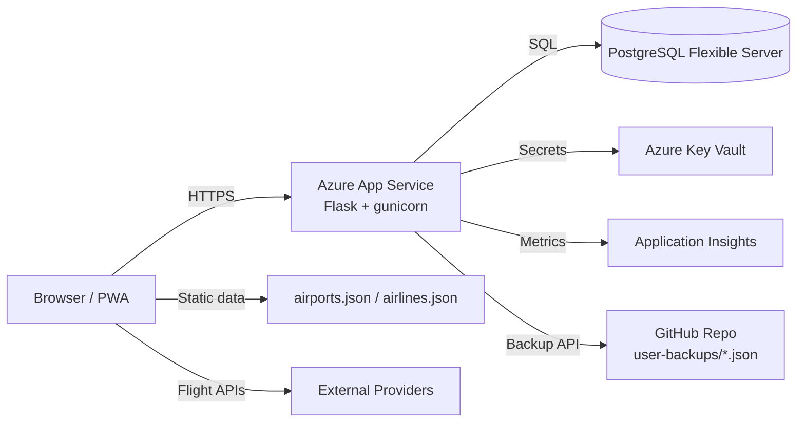

# SkyTrace Architecture

## Overview

SkyTrace is a multi-user flight log manager with a PWA frontend, Flask backend,
PostgreSQL storage, and optional GitHub backups. It also supports a static-mode
fallback when no backend is available.

## High-Level Diagram

## Components

### Frontend (PWA)

- Single-page app (index.html + static/js/app.js)
- Leaflet map with great-circle arcs and heatmap layers
- Service worker for offline caching and installability
- Static-mode support (static/js/static-mode.js) using localStorage

### Backend (Flask)

- REST API for auth, flights, settings, stats, backup
- User isolation via user_id on all flight queries
- Encryption for API keys and GitHub backup tokens (Fernet)

### Data Layer

- SQLAlchemy models in storage.py
- Core tables:
  - users
  - flights
  - user_settings

### External Integrations

- AviationStack, AirLabs, AeroDataBox for flight data
- Open-Meteo for weather
- GitHub repository for per-user JSON backups

## Data Flow

### Authentication

1. User logs in via /api/auth/login
2. Flask session cookie is set
3. Auth state checked via /api/auth/state

### Flight CRUD

1. Frontend submits flight data to /api/flights
2. Backend stores rows in flights table (scoped by user_id)
3. Frontend refreshes cached list and renders arcs

### Settings and Secrets

1. User saves API keys in /api/settings
2. Backend encrypts keys before storage
3. Frontend receives masked values only

### GitHub Backup

1. User configures token and repo in settings
2. Backend encrypts token and stores repo name
3. /api/backup/github/push writes user JSON into repo

### Static Mode

1. Frontend probes /api/version
2. If unavailable, switch to localStorage-backed mode
3. API calls are handled locally or proxied via CORS

## Security and Privacy

- Password hashing: Werkzeug generate_password_hash (pbkdf2:sha256)
- Encrypted fields: Fernet symmetric encryption
- Cookies: HttpOnly, SameSite=Lax, Secure controlled by env
- Rate limiting: login attempts capped per IP

## Deployment Notes

- App Service uses gunicorn and Python 3.12
- Environment variables injected by Key Vault
- GitHub Actions deploys on push

## Versioning

- Frontend and backend versions are kept aligned via SKYTRACE_VERSION
- Service worker updated on release to refresh cached assets
